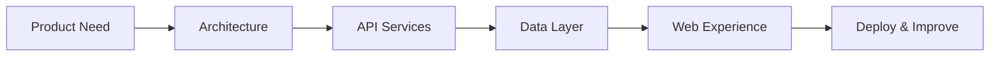

<div align="center">


<br />

[](https://www.linkedin.com/in/leonardo-flores-dev/)


### I design the systems behind digital products.

`Backend Architecture` · `REST APIs` · `AI` · `Automation` · `Full Stack Development`

</div>

---

<table>
<tr>
<td width="55%" valign="top">

## Profile

Backend-focused Full Stack Developer building maintainable APIs, integrations, automation workflows, and complete web products.

```text
ROLE       Full Stack Developer
FOCUS      Backend Engineering
LOCATION   Quito, Ecuador
LANGUAGES  Spanish · English
```

</td>
<td width="45%" valign="top">

## Engineering Focus

```text
01  Architecture
02  APIs & Services
03  Data & Integrations
04  AI & Automation
05  Product Delivery
```

</td>
</tr>
</table>

<details>
<summary><strong>Leer presentación en español</strong></summary>

<br />

Desarrollador Full Stack con enfoque en backend. Diseño APIs, integraciones, automatizaciones y productos web mantenibles, conectando arquitectura técnica con necesidades reales de negocio.

</details>

---

## Technology Stack

<div align="center">

### Core Backend


### Frontend


### Data & Delivery


</div>

---

## System Mindset



<table>
<tr>
<td align="center" width="25%">

### Design

Modular systems  
Clear boundaries

</td>
<td align="center" width="25%">

### Build

Reliable APIs  
Business logic

</td>
<td align="center" width="25%">

### Connect

Data flows  
Integrations

</td>
<td align="center" width="25%">

### Deliver

Containers  
Deployment

</td>
</tr>
</table>

---

## Project Lab

<table>
<tr>
<td width="33%" valign="top">

### 01 · Backend Platform

Authentication, roles, permissions, REST APIs, testing and Docker.

`FastAPI` `PostgreSQL`

**Status:** Planned

</td>
<td width="33%" valign="top">

### 02 · Automation Engine

Events, background jobs, integrations, monitoring and recovery.

`Python` `Redis`

**Status:** Planned

</td>
<td width="33%" valign="top">

### 03 · AI Product

Structured AI workflows, human review and usage controls.

`AI` `Full Stack`

**Status:** Planned

</td>
</tr>
</table>

> The portfolio is being rebuilt around production-oriented projects with architecture notes, tests, documentation, screenshots and deployment.

---

## Engineering Standard

<table>
<tr>
<td width="33%" align="center">

### Clear

Readable structure  
Useful documentation

</td>
<td width="33%" align="center">

### Reliable

Validation  
Testing  
Predictable behavior

</td>
<td width="33%" align="center">

### Maintainable

Purposeful architecture  
Simple decisions

</td>
</tr>
</table>

---

<div align="center">

## Let’s Build Something Reliable

Open to **Backend Developer** and **Full Stack Developer** opportunities.

[](https://www.linkedin.com/in/leonardo-flores-dev/)

<br /><br />

<sub>Architecture · APIs · Data · AI · Automation</sub>

</div>
