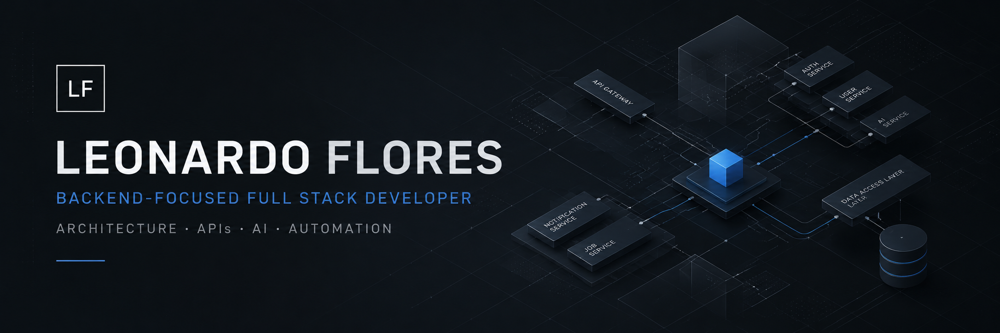
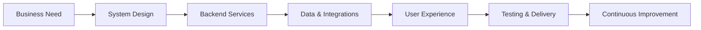

<div align="center">



<br />

<a href="https://git.io/typing-svg">
  
</a>

<br />

[](https://www.linkedin.com/in/leonardo-flores-dev/)


</div>

---

## Engineering Profile

<table>
<tr>
<td width="60%" valign="top">

### Building beyond the interface

I am a **Backend-Focused Full Stack Developer** interested in designing the systems that power modern digital products.

My work combines backend development, web architecture, API design, frontend implementation, artificial intelligence, and workflow automation.

I approach software as a complete system: business rules, data models, services, integrations, user experience, deployment, and long-term maintainability.

</td>
<td width="40%" valign="top">

### Core Direction

```text
FOCUS       Backend Engineering
DESIGN      Web Architecture
BUILD       APIs & Integrations
EXPLORE     AI & Automation
DELIVER     Full Stack Products
```

### Current Status

```text
Based in    Quito, Ecuador
Languages   Spanish · English
Open to     Backend / Full Stack roles
```

</td>
</tr>
</table>

<details>
<summary><strong>Versión en español</strong></summary>

<br />

Soy **desarrollador Full Stack con enfoque en backend**, interesado en diseñar los sistemas que impulsan productos digitales modernos.

Mi trabajo combina desarrollo backend, arquitectura web, diseño de APIs, implementación frontend, inteligencia artificial y automatización de procesos.

Entiendo el software como un sistema completo: reglas de negocio, modelos de datos, servicios, integraciones, experiencia de usuario, despliegue y mantenibilidad a largo plazo.

Actualmente busco oportunidades en desarrollo backend y Full Stack donde pueda contribuir en proyectos reales y seguir fortaleciendo mi experiencia técnica.

</details>

---

## Technical Ecosystem

<div align="center">

### Backend & Application Development


### Frontend Engineering


### Data, Infrastructure & Workflow


</div>

<br />

<table>
<tr>
<td align="center" width="25%">

**Architecture**

Layered systems  
Modular design  
Separation of concerns

</td>
<td align="center" width="25%">

**Backend**

REST APIs  
Business logic  
Authentication

</td>
<td align="center" width="25%">

**Data**

Relational modeling  
Validation  
Reliable persistence

</td>
<td align="center" width="25%">

**Delivery**

Version control  
Containerization  
Deployment workflows

</td>
</tr>
</table>

---

## How I Think About Software



> Good software is not only code that works. It is a system that can be understood, maintained, tested, and improved.

---

## Engineering Principles

<table>
<tr>
<td width="50%" valign="top">

### 01 · Clarity before complexity

I prefer explicit structures, understandable decisions, and code that another developer can maintain.

### 02 · Architecture with purpose

Patterns and abstractions should solve real problems—not exist only to make a project appear sophisticated.

### 03 · Backend reliability

Validation, predictable behavior, data integrity, and meaningful error handling are part of the product.

</td>
<td width="50%" valign="top">

### 04 · User-centered delivery

Even backend decisions influence performance, usability, security, and the final customer experience.

### 05 · Documentation as engineering

A strong project should explain how it works, why decisions were made, and how another developer can run it.

### 06 · Continuous improvement

Every project is an opportunity to improve design decisions, testing practices, automation, and delivery.

</td>
</tr>
</table>

---

## Portfolio Roadmap

I am building a collection of production-oriented projects that demonstrate complete engineering decisions—not isolated code exercises.

<table>
<tr>
<td width="33%" valign="top">

### API Platform

Secure authentication, roles, permissions, validation, documentation, testing, and containerized deployment.

**Focus:** Backend architecture

</td>
<td width="33%" valign="top">

### Automation System

Event-driven workflows, third-party integrations, background jobs, monitoring, and failure recovery.

**Focus:** Integrations and automation

</td>
<td width="33%" valign="top">

### AI-Enabled Product

Practical AI integration with structured outputs, human review, usage controls, and measurable business value.

**Focus:** Applied artificial intelligence

</td>
</tr>
</table>

> Each project will include architecture documentation, setup instructions, technical decisions, tests, screenshots, and a live demonstration whenever possible.

---

## Development Workflow

```text
01  Understand the problem
02  Define requirements and constraints
03  Model the domain and data
04  Design services and API contracts
05  Implement in small, verifiable increments
06  Test critical behavior
07  Document technical decisions
08  Containerize and deploy
09  Observe, learn, and improve
```

---

## What I Am Strengthening

- Backend architecture and scalable service design
- Authentication, authorization, and application security
- Relational data modeling and database performance
- Automated testing and software quality
- Containers, deployment, and production workflows
- AI integration and business process automation
- Technical communication in Spanish and English

---


## Let’s Connect

I am open to **Backend Developer** and **Full Stack Developer** opportunities where I can contribute, learn, and build reliable software with a collaborative team.

<div align="center">

[](https://www.linkedin.com/in/leonardo-flores-dev/)

<br /><br />

<sub>Architecture · APIs · Data · AI · Automation</sub>

</div>
